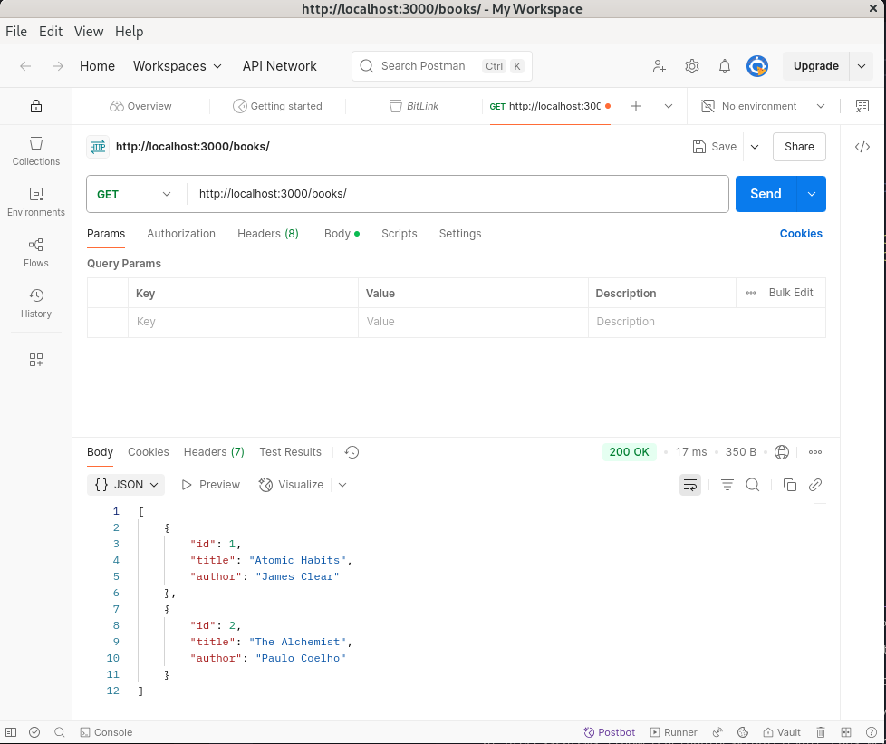
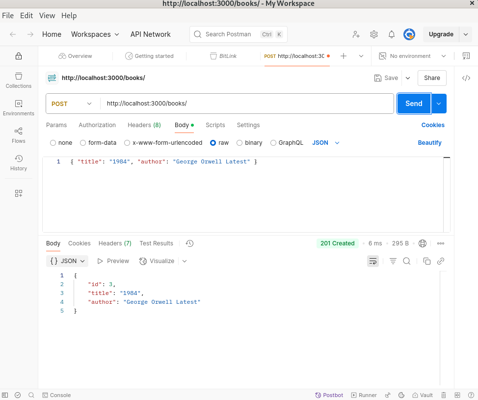
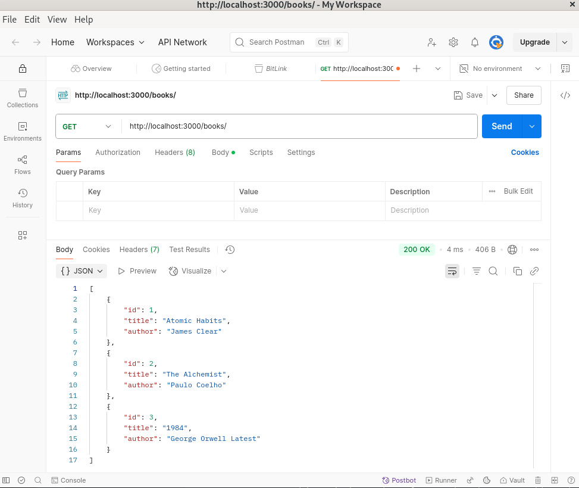
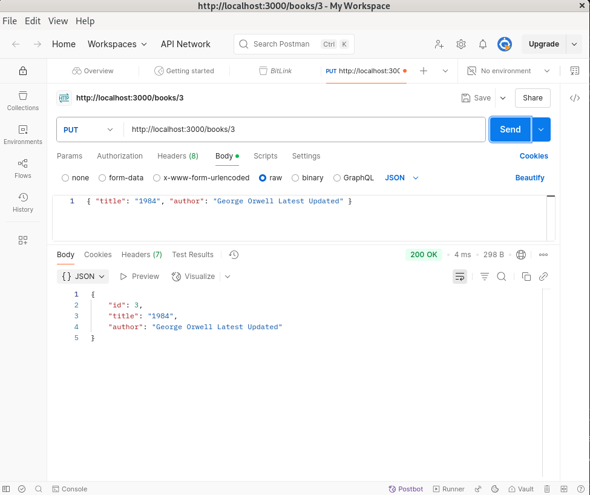
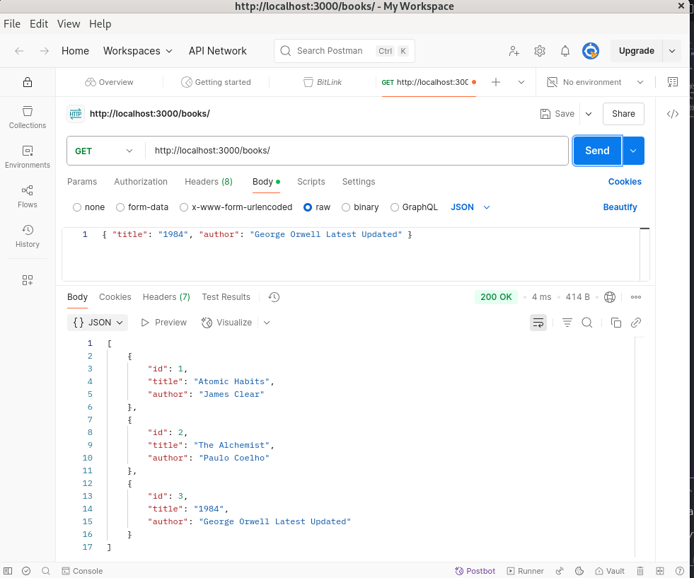
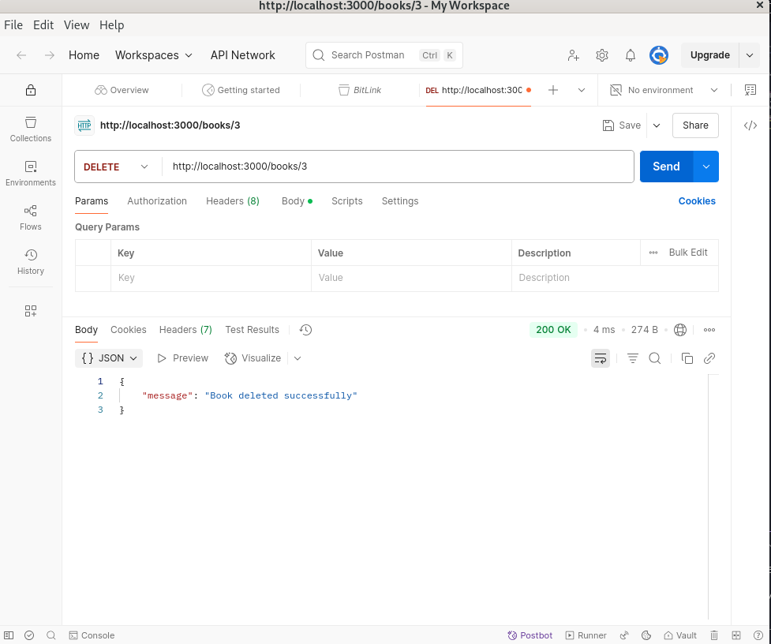
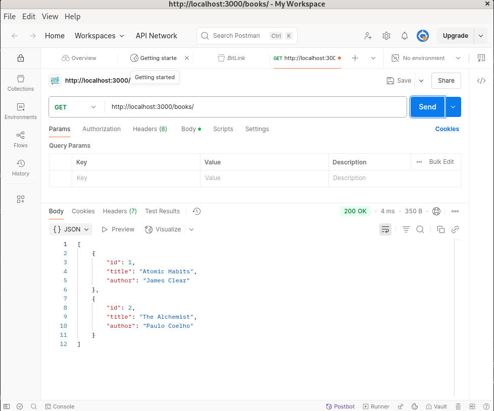

# 📚 Book Management REST API

This project is a simple RESTful API built using **Node.js** and **Express** to manage a list of books. It supports full **CRUD (Create, Read, Update, Delete)** operations and stores data in memory (no database).

---

## 🚀 Features

- Get all books
- Add a new book
- Update an existing book by ID
- Delete a book by ID

---

## 🛠️ Tech Stack

- Node.js
- Express
- Postman (for API testing)

---

## 📁 Project Structure

book-api/

├── node_modules/

├── package.json

└── index.js

---

## 📦 Installation & Setup

### 1. Clone the Repository

```bash
git clone https://github.com/your-username/book-api.git
cd book-api
npm install
node index.js
```

OR
```
mkdir book-api
cd book-api
npm init -y
npm install express
touch index.js
- Copy the code in index.js and paste
node index.js

```

The server will run at:
👉 http://localhost:3000
Postman

1. GET
   - Sends a GET request to fetch all books from the API. 


2. POST
   - Sends a POST request to add a new book to the collection. 

   - Verifies that the new book has been added.


3. PUT
   - Sends a PUT request to update an existing book by its ID.  

   - Verifies that the book information has been updated. 


4. DELETE
   - Sends a DELETE request to remove a book by its ID.  

   - Verifies that the book has been deleted.

