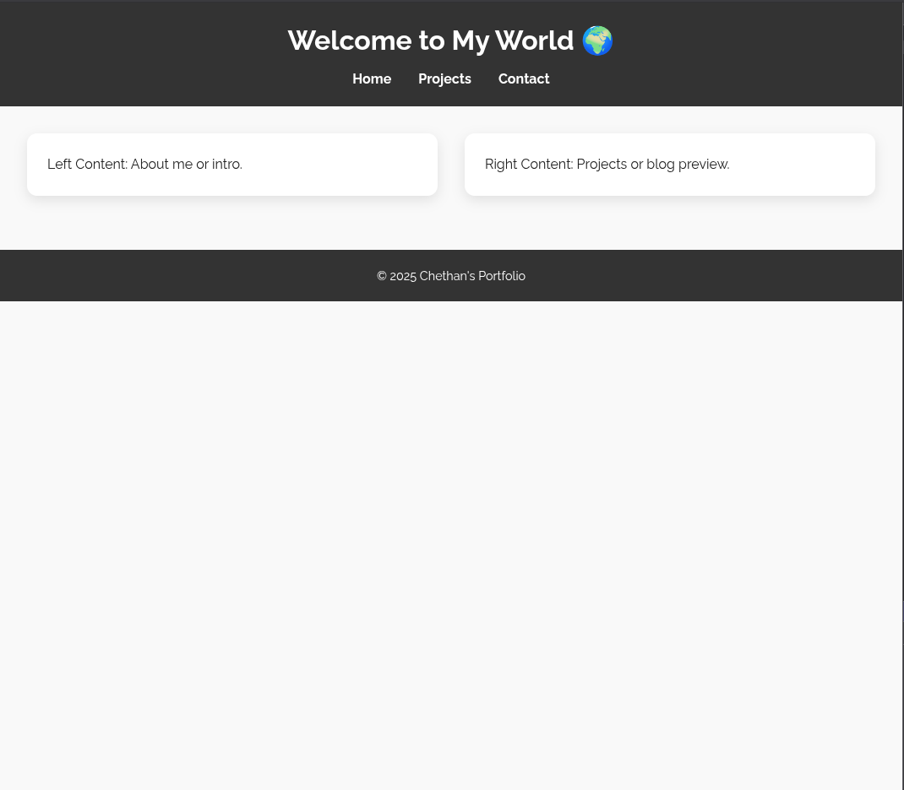
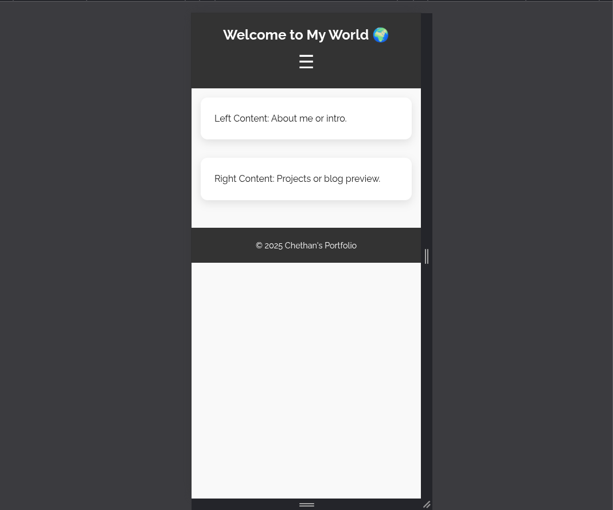
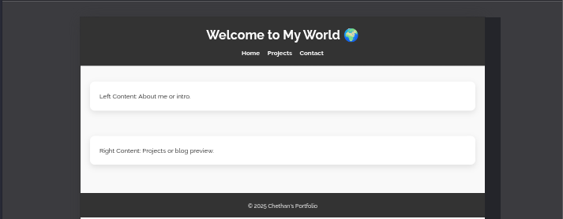

# 🌐 Task 4: Make a Website Mobile-Friendly Using CSS Media Queries

## 📱 Objective
Convert a desktop-only webpage into a **responsive and flexible layout** compatible with **mobile, tablet, and desktop** viewports using **CSS media queries**.

---

## ✨ Features Implemented

- 📱 **Mobile-first responsive design**
- 💻 **Tablet and desktop support** with breakpoints
- 🍔 **Hamburger menu** for mobile nav toggle
- 📐 **Clamp-based fluid font sizing**
- 🧱 **Flexbox layout with vertical stacking on smaller screens**
- 🖼️ **Responsive images and cards**
- 🎨 **Google Fonts typography and hover animations**
- 💡 **Clean and modern UI/UX**

---

## 🔍 Key Concepts Used

- `@media` queries for:
  - `max-width: 1024px` (Tablet)
  - `max-width: 768px` (Mobile)
- CSS Units: `rem`, `vw`, `%`, and `clamp()`
- Flexbox layout and responsive stacking
- Transition and animation for better interaction
- Responsive navigation menu toggle with JavaScript

---

## 📸 Screenshots

### 🖥️ Desktop View

### 📱 Mobile View

### 📲 Tablet View

> Screenshots taken using Chrome DevTools Device Toolbar

---

## 📂 Folder Structure

├── index.html
├── styles.css
├── assets/
│ ├── desktop-view.png
│ ├── mobile-view.png
│ └── tablet-view.png