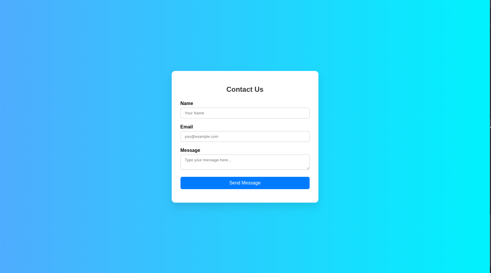
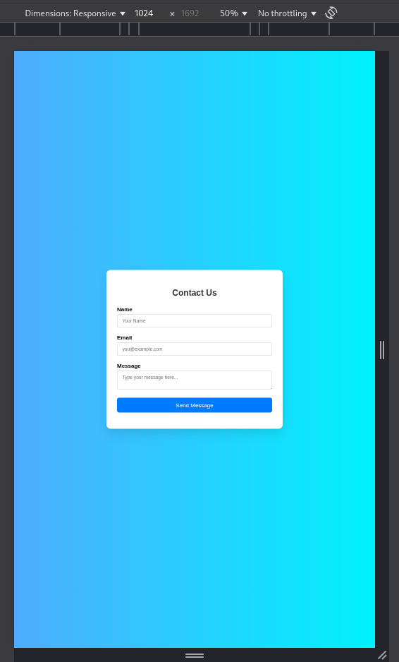

# Contact Form with Client-Side Validation

A modern, responsive Contact Form built with HTML, CSS, and JavaScript, featuring real-time validation, visual feedback, and user-friendly design — all without using any external libraries.

---

## 🚀 Live Demo
🌐 [Click here to view the live form](#)


---

## 🧰 Tech Stack

- **HTML5**
- **CSS3** (Flexbox, Transitions, Gradient Background)
- **JavaScript** (Regex, DOM Manipulation, Event Handling)

---

## 🎯 Features

- ✨ Fully responsive layout
- ✅ Client-side validation for:
    - **Name:** Non-empty
    - **Email:** Valid format using regex
    - **Message:** Minimum 10 characters
- 🛑 Prevents form submission if invalid
- 📢 Displays inline error messages
- ✅ Shows success message after valid submission
- 🔒 No actual data is sent (client-side only)
- ⚡️ Fast and lightweight (no libraries)

---

## 📁 Folder Structure

```
contact-form/
│
├── index.html       # HTML form layout
├── style.css        # Styling and layout
└── script.js        # Validation and interaction logic
```

---

## 🖼️ UI Preview

| Desktop 💻 | Mobile 📱 |
|------------|-----------|
|  |  |

---

## 🧠 How Validation Works

- **Name:** Checked for non-empty value.
- **Email:** Validated using regex:  
    ```js
    /^[\w.-]+@[\w.-]+\.\w+$/
    ```
- **Message:** Must be at least 10 characters long.
- ❗ Errors are shown directly below each field.
- ✅ If all fields are valid, a green success message is shown.

---

## 🔬 Edge Cases Handled

- ❌ Empty name/email/message
- ❌ Invalid email format (e.g., `john@com`, `@gmail.com`)
- ❌ Short messages
- ✅ Special characters supported in name/message

---