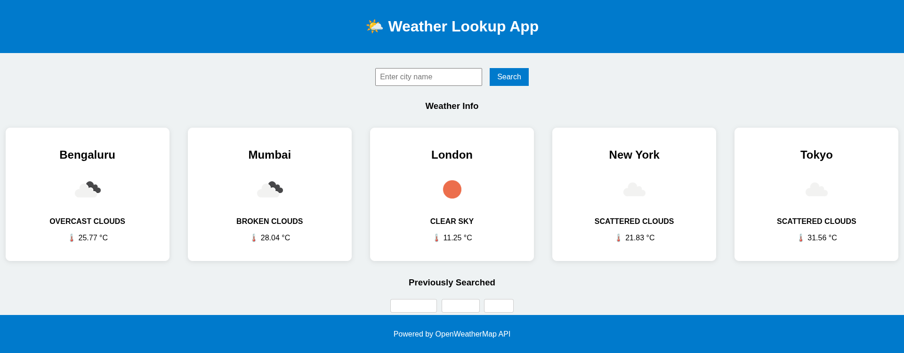
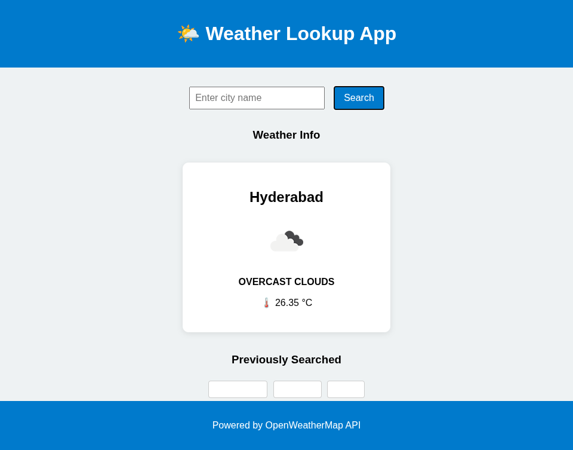

# 🌤️ Weather Lookup App | Task 7 — Advanced Fetch API Project

A fully responsive Weather Lookup Web App built using **JavaScript Fetch API**, HTML, and CSS. It allows users to **search real-time weather** by city, view **default cities** on page load, and revisit **previously searched cities** with a single click.

This project demonstrates advanced client-side skills including **async data fetching**, **dynamic UI rendering**, **error handling**, **localStorage caching**, and **responsive design**.

---

## 🚀 Live Demo

🔗 [Click to View Deployed App](https://7chethan007.github.io/Task-7-WeatherApp/](https://7chethan007.github.io/Elevate_Labs_WebDev_Internship_T7_Fetch_API/))  

---

## 🖼️ Screenshots

### Default Cities Display

Weather cards for default cities shown on initial page load.

### Searched City Example

Weather card for a city (e.g., Dubai) searched by the user, not in the default list.
### Searched City Example: Hyderabad

Weather card for Hyderabad, searched by the user.

### Searched City Example: Coimbatore

Weather card for Coimbatore, searched by the user.
---

## 🧠 How It Works

- On page load:
    - Weather for **5 default cities** is displayed (e.g., Bengaluru, London, Tokyo, etc.)
    - **Search history** (from `localStorage`) is also displayed as buttons
- On typing a city and hitting "Search":
    - Weather is fetched from **OpenWeatherMap API**
    - Data is displayed in a new weather card
    - The city is added to **search history**
- Clicking a **history button** re-fetches weather for that city

---

## 📦 Features

✅ Default city weather shown on page load  
✅ Real-time weather search by city name  
✅ Interactive **search history** using `localStorage`  
✅ Graceful error handling (`try...catch`)  
✅ Loading indicator while fetching  
✅ Modern and responsive card layout  
✅ Search persists across reloads  
✅ Clean, modular, beginner-friendly code

---

## 🌐 Example Cities & Results

| City Name    | Displayed on Load? | Data |
|--------------|--------------------|------|
| Bengaluru    | ✅                 | 🌡️ 27°C, clear sky |
| New York     | ✅                 | 🌡️ 18°C, overcast clouds |
| Tokyo        | ✅                 | 🌡️ 25°C, light rain |

---

## 🧰 Tech Stack

- **HTML5** – structure
- **CSS3** – responsive UI, layout with Flexbox
- **JavaScript** – fetch API, DOM manipulation, localStorage
- **OpenWeatherMap API** – real-time weather data

---
