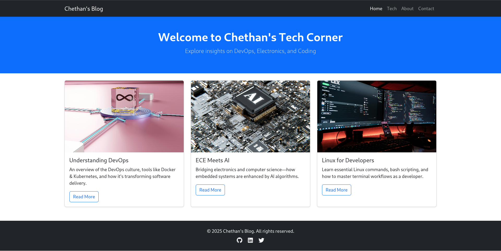

## 📝 Task 8: Create a Simple Blog Layout Using Bootstrap 5

**Objective:** Build a responsive blog page using Bootstrap 5 CDN, featuring a navbar, blog post cards, and a footer.

**Tools:** VS Code, Bootstrap CDN, Web Browser

**Deliverables:** A responsive blog page utilizing Bootstrap components.

**Outcome:** Gain hands-on experience with Bootstrap for rapid UI development and responsive web layouts.

# 🚀 [Live Demo](https://7chethan007.github.io/Elevate_Labs_WebDev_Internship_T8/)

# 📘 Chethan's Tech Blog

A clean, responsive, and creative tech blog layout built using Bootstrap 5. The blog features a sticky navbar, responsive card-based posts, a scroll-to-top button with JavaScript, and a modern footer with social media icons.

---

## 📸 Screenshot



---

## 🚀 Features

- **Responsive Navbar** with brand and navigation links
- **Hero Section** introducing the blog
- **Blog Cards** displaying posts with image, title, description, and CTA button
- **Responsive Layout** using Bootstrap Grid
- **Scroll-to-Top Button** (custom JavaScript)
- **Footer** with social media icons (Font Awesome)
- **Mobile-First Design** optimized for all screen sizes

---

## 🛠️ Technologies Used

- [Bootstrap 5 CDN](https://getbootstrap.com/)
- [Font Awesome](https://fontawesome.com/)
- HTML5, CSS3, JavaScript

---

## 📁 Project Structure

```
project-folder/
│
├── index.html         # Main HTML file
├── style.css          # Custom CSS (optional)
├── script.js          # Scroll-to-top JS
└── assets/
    └── demo.jpg       # UI preview (screenshot)
```

---

## 💡 How to Use

1. **Clone or download** this repository.
2. **Open** `index.html` in any browser.
3. **Customize** content, add more posts, or enhance features as needed.

---

## 🌐 Live Demo

[https://yourusername.github.io/bootstrap-blog/](https://yourusername.github.io/bootstrap-blog/)
